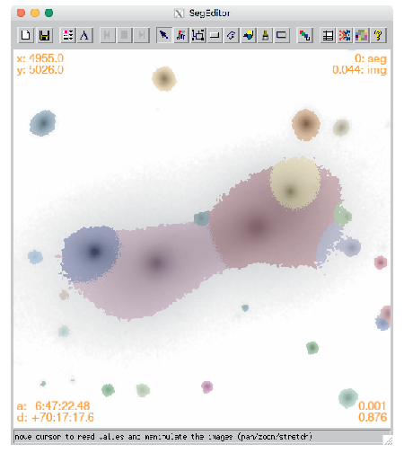

# Segmentation Editor: SegEditor



A Graphical-User Interface (GUI) for editing segmentation maps for IDL.

## Getting Started

Download the directories and put the src/ dir in the User's IDL_PATH environment variable.  The code is started by:

```
IDL> segeditor,SEGFILE,IMGFILE,[/help,_EXTRA=_extra]
```

where SEGFILE and IMGFILE are the full paths to a segmentation image and its corresponding direct image.  The /help flag will display a basic calling sequence, and _extra facilitates additional keyword arguments.


Once the GUI is loaded, there is a button for help (indicated by ), which will explain the various functionality.  But one also refer to the astro-ph article for more details and/or to reference (if you find this code was useful in preparing your data or manuscript [(Ryan 2018)](http://test).


## Additional Help
Please contact [Russell](mailto:rryan@stsci.edu) with additional problems or issues, or if you are interested in contributing.

<a href="mailto:rryan@stsci.edu?subject=hello world">Email Me!</a>
